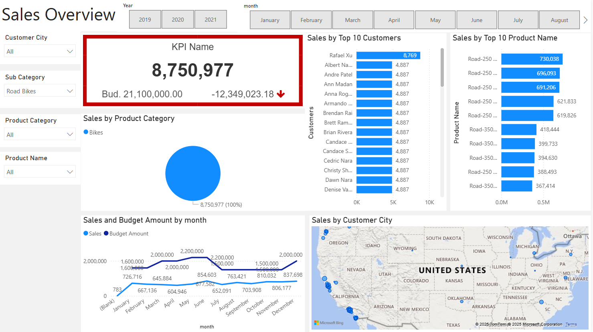
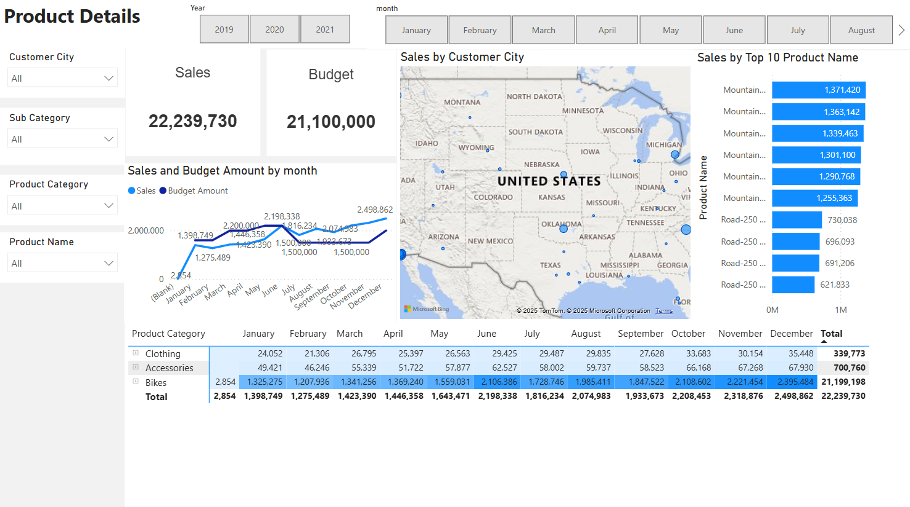
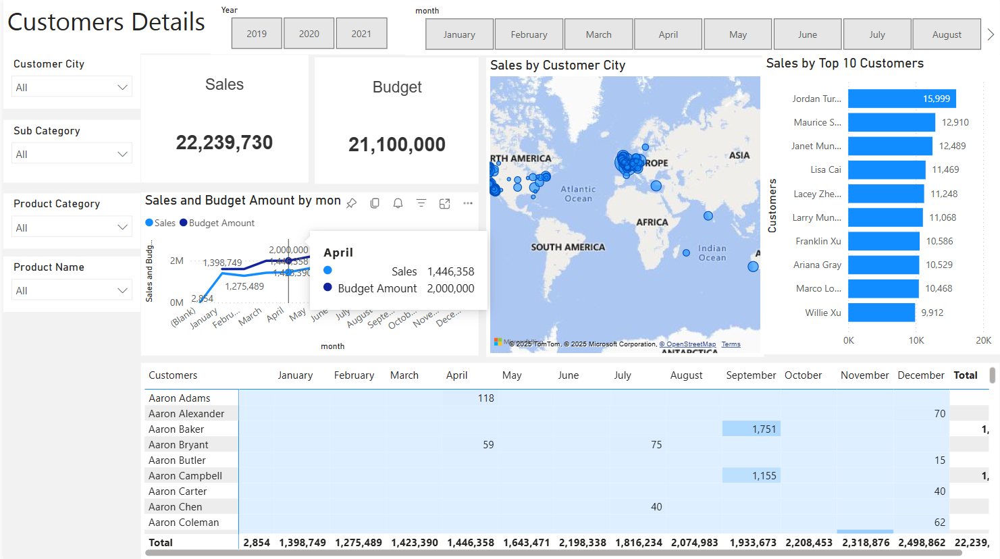

📈 Sales_Overview_Dashboard

A powerful business intelligence dashboard built using SQL and Power BI that enables detailed sales analysis, trend tracking, and performance evaluation across regions, categories, and time periods. Designed for decision-makers to gain quick and actionable insights through dynamic visualizations and interactive filters.

---

## 🎯 Project Goal

The objective of this project is to create an interactive and automated Sales Overview Dashboard that provides stakeholders with clear insights into:

- Monthly and yearly sales performance
- Budget vs actual comparisons
- Regional distribution of sales
- Top-performing products and customers

This project helps businesses identify trends, evaluate goals, and optimize product and marketing strategies.

---

## 🔧 Process Overview

1. **Data Extraction:**  
   Raw data was extracted from relational databases using SQL queries to obtain relevant sales, customer, and product information.

2. **Data Transformation:**  
   Cleaned and transformed the dataset to ensure consistency, accurate data types, and business-relevant measures.

3. **Data Modeling:**  
   A star schema model was created in Power BI to support high-performance querying and scalability.

4. **Visualization:**  
   Charts such as line graphs, pie charts, bar charts, and KPI cards were used for intuitive and interactive analysis.

---

## ✨ Key Features

- 📊 **Dynamic Filtering:** Filter by Year, Month, City, Product Category, Subcategory, and Product Name.
- 🧑‍💼 **Top 10 Rankings:** View top-performing customers and product names based on total sales.
- 📍 **Geo Analysis:** Map-based visualization of customer locations for regional insights.
- 🧮 **KPI Cards:** Monitor overall sales and budget variance instantly.
- 📈 **Sales vs Budget Trends:** Monthly comparison of actual sales against forecasted budgets.

---

### 📷 Dashboard Previews

#### 🔹 Main Overview

#### 🔹 Product Category Breakdown

#### 🔹 Customer Distribution by Region

---

## 🛠 Tools & Technologies

- **SQL:** Data querying and transformation  
- **Power BI:** Data visualization, modeling, and dashboard design  
- **DAX:** Custom measures, KPIs, and calculated fields  
- **Power BI Service:** Automated refresh and sharing

---

## 👤 Author

**Arge Ganga Prasad**  
Aspiring Data Analyst | SQL & Power BI Dashboard Enthusiast  

📫 [LinkedIn](https://www.linkedin.com/in/arge-gangaprasad/)  | 💻 [GitHub](https://github.com/gangaprasadarge)

